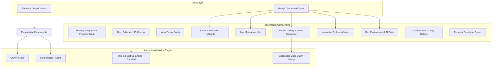

# PORTFOLIO ARCHITECTURE SPECIFICATION
**Project**: Sayed Nada — Digital Identity & Engineering Portfolio  
**Target Architecture**: Modern Component-Driven Scalable Architecture  

---

## 1. High-Level Architecture Overview



---

## 2. Proposed Modern Folder Structure

When migrating to a modular component architecture (e.g. React + TypeScript + Vite or refactored modular vanilla ES modules):

```text
d:/Protfilio/
├── assets/
│   ├── brand/
│   │   ├── favicon.svg
│   │   └── profile.jpg
│   ├── logos/
│   │   ├── antigravity_logo.svg
│   │   ├── claude_logo.svg
│   │   ├── gemini_logo.svg
│   │   └── stitch_logo.svg
│   ├── projects/
│   │   ├── aquasmart-dashboard.webp
│   │   ├── aquasmart-ui.webp
│   │   ├── broadband-network.webp
│   │   ├── food-design.webp
│   │   ├── moodle-sync.webp
│   │   ├── skillswap-hub.webp
│   │   └── skillswap-ui.webp
│   └── docs/
│       └── Sayed-Nada-CV.pdf
│
├── src/
│   ├── components/
│   │   ├── layout/
│   │   │   ├── Navbar.ts
│   │   │   ├── Footer.ts
│   │   │   ├── ScrollProgress.ts
│   │   │   └── FloatingScrollPill.ts
│   │   ├── hero/
│   │   │   ├── HeroContent.ts
│   │   │   ├── HeroStats.ts
│   │   │   └── ThreeBackground.ts
│   │   ├── sections/
│   │   │   ├── ServicesSection.ts
│   │   │   ├── AboutSection.ts
│   │   │   ├── CurrentlySection.ts
│   │   │   ├── SkillsSection.ts
│   │   │   ├── ToolsSection.ts
│   │   │   └── ContactSection.ts
│   │   ├── projects/
│   │   │   ├── ProjectsGrid.ts
│   │   │   ├── ProjectCard.ts
│   │   │   ├── ProjectFilterTabs.ts
│   │   │   └── ProjectCaseStudyModal.ts
│   │   └── ui/
│   │       ├── Button.ts
│   │       ├── Badge.ts
│   │       ├── CopyButton.ts
│   │       └── Card.ts
│   │
│   ├── data/
│   │   ├── personal.data.ts
│   │   ├── projects.data.ts
│   │   ├── skills.data.ts
│   │   ├── tools.data.ts
│   │   └── currently.data.ts
│   │
│   ├── motion/
│   │   ├── gsapEngine.ts
│   │   ├── heroTimeline.ts
│   │   ├── scrollTriggers.ts
│   │   ├── cardTilt.ts
│   │   └── reducedMotion.ts
│   │
│   ├── styles/
│   │   ├── tokens.css
│   │   ├── reset.css
│   │   ├── typography.css
│   │   ├── components.css
│   │   ├── animations.css
│   │   └── responsive.css
│   │
│   └── types/
│       ├── project.types.ts
│       ├── skill.types.ts
│       └── portfolio.types.ts
│
├── index.html
├── style.css
├── script.js
└── data.js
```

---

## 3. Component Hierarchy & Responsibilities

| Component | Responsibility | Props / Data Inputs | Key Interactions |
| :--- | :--- | :--- | :--- |
| **`Navbar`** | Header navigation, branding, active section tracking | `navLinks`, `activeSection` | Smooth anchor scrolling, scroll shrink |
| **`ScrollProgress`** | Precision scroll position display | `window.scrollY` | Real-time width tween + percentage |
| **`HeroContent`** | Immediate personal identity & primary CTAs | `personalData`, `statsData` | GSAP stagger entrance, magnetic CTAs |
| **`ThreeBackground`** | Ambient particle & wireframe 3D canvas | Device pixel ratio, mouse coords | Inertial mouse parallax, viewport pause |
| **`ProjectCard`** | 16:9 thumbnail preview, category pill, tech tags | `Project` data object | 3D hover tilt, Quick View, Modal trigger |
| **`ProjectCaseStudyModal`**| Detailed problem / solution / impact dialog | `activeProject` | Focus trap, image preview, Escape listener |
| **`SkillsSection`** | Categorized tech toolbox | `skillsData`, `activeCategory` | Filter tab switch, stagger cards |
| **`ContactSection`** | Low-friction communication hub | `contactChannels` | Clipboard copy with tooltip confirmation |
| **`Footer`** | Personal closing statement & back to top | `socialLinks` | Smooth scroll to top |

---

## 4. Data Architecture & Type Definitions

```typescript
export interface ProjectDetails {
  problem: string;
  solution: string;
  impact: string;
}

export type ProjectCategory = 
  | 'frontend'
  | 'fullstack'
  | 'database'
  | 'uiux'
  | 'other';

export interface Project {
  id: string;
  title: string;
  category: string;
  filter: ProjectCategory;
  image: string;
  icon: string;
  description: string;
  tech: string[];
  github?: string;
  live?: string;
  details: ProjectDetails;
  featured?: boolean;
}

export interface SkillItem {
  name: string;
  icon: string;
  level: 'Beginner' | 'Familiar' | 'Intermediate' | 'Proficient';
  invert?: boolean;
}

export interface CurrentlyFocusItem {
  title: string;
  detail: string;
  status: 'Upgrading' | 'Refining' | 'Learning' | 'Active';
  icon: string;
}

export interface PersonalProfile {
  name: string;
  title: string;
  age: number;
  location: string;
  phone: string;
  whatsapp: string;
  email: string;
  github: string;
  linkedin: string;
  education: {
    university: string;
    faculty: string;
    duration: string;
  };
  about: string;
}
```

---

## 5. State Management & Lifecycle

- **Active Section State**: Determined by `IntersectionObserver` observing all major `<section>` boundaries.
- **Active Filter State**: Clean string state (`'all'`, `'frontend'`, `'fullstack'`, `'database'`, `'uiux'`). When updated, GSAP gracefully flips/fades project cards.
- **Modal State**: Boolean `isModalOpen` toggles body scroll lock (`overflow: hidden`) and opens `<dialog>`/custom accessible modal overlay.
- **Scroll Percentage**: Calculated via `(scrollY / (scrollHeight - innerHeight)) * 100` and updated with requestAnimationFrame for jitter-free 60fps performance.

---

## 6. Performance & Optimization Architecture

1. **Asset Compression Pipeline**:
   - Project preview images stored as `.webp` at 1280x720 (max 90 KB each).
   - Local SVGs cleaned and inlined where appropriate to minimize HTTP requests.
2. **Three.js WebGL Render Guard**:
   - `IntersectionObserver` disconnects/pauses the WebGL render loop when the Hero section scrolls completely out of view, reducing background GPU usage to **0%**.
3. **Event Listener Throttling**:
   - Global `mousemove` coordinates for 3D parallax use lightweight linear interpolation (`lerp`) on animation frames rather than triggering style recalculations on every mouse event.
4. **CSS Hardware Acceleration**:
   - All animations strictly target `transform` (GPU composite) and `opacity`, avoiding expensive reflow properties (`top`, `margin`, `width`, `height`).

---

## 7. SEO & Semantic HTML Architecture

- **Semantic Landmarks**: Strict `<header>`, `<nav>`, `<main>`, `<section>`, `<article>`, `<aside>`, `<footer>` structure.
- **Heading Hierarchy**:
  - Single `<h1>`: `Sayed Nada — Frontend Developer & UI/UX Designer`
  - `<h2>`: Section titles (`Selected Work Focus`, `Featured Projects`, `My Skills`, `Let's Connect`)
  - `<h3>`: Card titles and project names
- **Structured JSON-LD Schema**:
  - `Person`: Name, JobTitle, AlumniOf, Url, SameAs.
  - `WebSite`: Name, Url, Author.
  - `CreativeWork` & `SoftwareSourceCode`: For each project in `data.js`.
