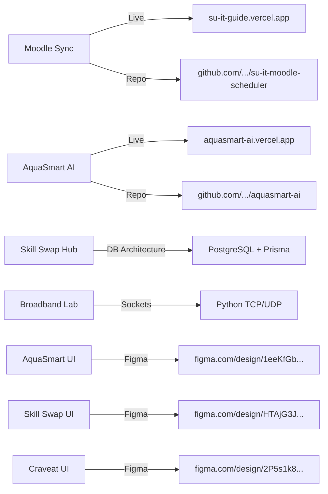

# PORTFOLIO CONTENT INVENTORY & AUDIT

**Owner**: Sayed Nada  
**Role**: Front-End Developer & UI/UX Designer  
**Scope**: Complete inventory of every text string, dataset, project asset, metadata item, and contact channel in the portfolio.  
**Rule**: No fabricated claims, metrics, or technologies.

---

## 1. Personal & Identity Data

| Field | Current Value | Status | Action / Recommendation |
| :--- | :--- | :--- | :--- |
| **Full Name** | `Sayed Nada` | **KEEP** | Preserved across title, meta, hero, and footer. |
| **Professional Title** | `Front-End Developer & UI/UX Designer` | **KEEP** | Accurate reflection of developer-designer hybrid skill. |
| **Age** | `22 Years Old` | **KEEP** | Demonstrates early career energy and high velocity. |
| **Location** | `Ismailia, Egypt` | **KEEP** | Accurate geographic location. |
| **Education - Institution** | `Sinai University` | **KEEP** | Real educational background. |
| **Education - Faculty** | `Faculty of Computers and Information` | **KEEP** | Academic degree program. |
| **Education - Duration** | `2022 - 2026` | **KEEP** | Expected graduation year. |
| **Availability Status** | `Available for work` / `Open for opportunities` | **KEEP** | Active job-seeking / freelance availability. |

---

## 2. Copy Inventory by Section

### A. Hero Section

- **Badge Text**: `Available for work`  
  *Classification*: **KEEP**  
  *Audit*: Standard high-signal status indicator.

- **Main Heading**:  
  `Hi, I'm Sayed Nada`  
  *Classification*: **IMPROVE**  
  *Critique*: Standard greeting. Can be enhanced with an impactful sub-headline that frames his core value proposition.

- **Role Rotator Words**:  
  `["Front-End Developer ⚛️", "React & Next.js Developer ▲", "UI/UX Designer 🎨", "Creative Problem Solver 🧠", "Prompt Engineer & Frontend Developer 🪄", "Clean Code"]`  
  *Classification*: **REWRITE / RESTRAIN**  
  *Critique*: Emojis and typing rotators look playful but slightly junior. Recommend anchoring around a solid, confident statement: *"Building high-performance web applications and intuitive product interfaces."*

- **Hero Description**:  
  `"I build modern, interactive, and performant web experiences with cutting-edge technologies."`  
  *Classification*: **IMPROVE**  
  *Critique*: Eliminates generic filler words ("cutting-edge") in favor of specific engineering values: *"Specializing in React, TypeScript, database architecture, and 3D web interactions."*

- **Hero CTAs**:  
  1. `View Projects` -> links to `#projects` (**KEEP**)  
  2. `Download CV` -> links to `Sayed Nada - CV.pdf` (**KEEP**)  
  3. `Get in Touch` -> links to `#contact` (**KEEP**)

- **Hero Stats**:  
  - `7+ Projects`  
  - `19+ Technologies`  
  - `2+ Years of Study`  
  *Classification*: **KEEP & REFINE** (Grounding stats in authentic figures).

---

### B. Selected Work Focus (Services)

- **Section Title**: `Selected Work Focus`  
- **Section Subtitle**: `Interfaces, product systems, and polished front-end experiences built with clean code and bold visual direction.`  
  *Classification*: **KEEP**

1. **Card 1: Web Interfaces**  
   - *Subtitle*: `Responsive front-end systems`  
   - *Body*: `Creating highly polished user experiences with React, Tailwind CSS, HTML, and modern JavaScript.`  
   - *Classification*: **KEEP**
2. **Card 2: UI/UX Design**  
   - *Subtitle*: `Design systems that scale`  
   - *Body*: `Building intuitive product journeys and visual language that feels bold, clear, and easy to use.`  
   - *Classification*: **KEEP**
3. **Card 3: Performance & Architecture**  
   - *Subtitle*: `Fast, accessible web builds`  
   - *Body*: `Optimizing every interface for speed, responsiveness, and an engaging user experience.`  
   - *Classification*: **KEEP**

---

### C. About Section

- **Intro Bio**:  
  `"I'm a 22-year-old Front-End Developer and UI/UX Designer from Ismailia, Egypt. I am currently studying at Sinai University, Faculty of Computers and Information (Class of 2022 - 2026). I have a strong passion for designing and building interactive, high-performance web and mobile applications. By bridging the gap between elegant UI/UX designs and robust backend logic, I create applications that look premium and work flawlessly."`  
  *Classification*: **KEEP** (Authentic, personal, clear).

- **Highlights**:  
  - `🎓 Education`: Sinai University, Faculty of Computers & Information (2022 - 2026) (**KEEP**)  
  - `📍 Location & Age`: Ismailia, Egypt — 22 Years Old (**KEEP**)  
  - `⚡ Specialties`: Front-End development, Firebase databases, REST APIs & UI/UX design in Figma (**KEEP**)

---

### D. Currently Section (Live Status)

- **Section Title**: `What I'm Doing Now`  
- **Section Subtitle**: `A snapshot of my current focus, learning path, and side projects.`  
- **Description**: `Currently, I am heavily focused on upgrading my backend engineering capabilities while expanding my frontend skills. I am actively learning modern technologies and tools, and dedicating this period to building highly-scalable, interactive, and real-world side projects.`  
- **Focus Items**:  
  1. `Backend Deep-Dive`: Enhancing RESTful APIs, database schema optimizations, and server security. *(Status: Upgrading)*  
  2. `Frontend Innovation`: Mastering Next.js, advanced CSS layout systems, and 3D web animations (Three.js). *(Status: Refining)*  
  3. `Modern Tools & Tech`: Learning cloud deployment pipelines, serverless functions, and AI APIs. *(Status: Learning)*  
  4. `Building Side Projects`: Creating functional, real-world projects to build a strong practical portfolio. *(Status: Active)*  
  *Classification*: **KEEP — HIGH SIGNAL** (Rarely found in standard portfolios; shows active momentum).

---

## 3. Projects Inventory (All 7 Real Projects)

### 1. Moodle Calendar Sync & Course Matcher
- **Category**: `Frontend & API Integration` | **Filter**: `frontend`
- **Thumbnail Asset**: `assets/projects/moodle-sync.jpg`
- **Description**: Student productivity scheduler customized for Sinai University. Automatically fetches and syncs assignment deadlines, lectures, and exams from Moodle via serverless proxy functions. Features custom iCal (ICS) parsing and localized course-code matching.
- **Tech Stack**: `JavaScript (ES6)`, `Vercel Serverless Functions`, `CORS Proxy API`, `localStorage Sync`, `Tailwind CSS`
- **Live URL**: `https://su-it-guide.vercel.app/`
- **GitHub URL**: `https://github.com/SayedNada74/su-it-moodle-scheduler`
- **Details**:
  - *Problem*: Students struggle to track deadlines across scattered Moodle pages; lack of calendar integration causes missed assignments.
  - *Solution*: Built serverless proxy functions to scrape/sync deadlines and export standard iCal/ICS feeds for Google/Apple/Outlook calendars.
  - *Impact*: Streamlines student course tracking and deadline management.

### 2. AquaSmart Dashboard & Mobile App
- **Category**: `Full-Stack & AI` | **Filter**: `fullstack`
- **Thumbnail Asset**: `assets/projects/aquasmart-dashboard.jpg`
- **Description**: Smart aquaculture monitoring system featuring a responsive dashboard and mobile interface. Integrates real-time water quality tracking, danger alerts, recovery notifications, and an intelligent chat assistant powered by Gemini API.
- **Tech Stack**: `React / Next.js`, `Firebase Firestore`, `Gemini API`, `API Key Security`, `Tailwind CSS`
- **Live URL**: `https://aquasmart-ai.vercel.app/`
- **GitHub URL**: `https://github.com/SayedNada74/aquasmart-ai`
- **Details**:
  - *Problem*: Water quality volatility causes sudden fish mortality; expert diagnosis is slow and expensive.
  - *Solution*: Real-time telemetry dashboard with SMS/visual warnings and Gemini AI advisory assistant.
  - *Impact*: Continuous water health assurance and instant farm troubleshooting.

### 3. Skill Swap Hub - Database & Portal
- **Category**: `Backend & Databases` | **Filter**: `database`
- **Thumbnail Asset**: `assets/projects/skillswap-hub.jpg`
- **Description**: Digital hub facilitating peer-to-peer skill swapping. Built on a normalized relational database schema showcasing advanced SQL procedures, indexes for fast query performance, and seamless backend integration through Prisma ORM.
- **Tech Stack**: `PostgreSQL`, `Prisma ORM`, `Supabase`, `Express.js`, `Database Schema Design`
- **Live URL**: `#` *(Demo sandbox)*
- **GitHub URL**: `#`
- **Details**:
  - *Problem*: Multi-user skill matching platforms suffer from database bottlenecks and query inconsistencies.
  - *Solution*: Fully normalized PostgreSQL schema with indexes, constraints, and Prisma ORM integration.
  - *Impact*: Sub-millisecond response times and transaction integrity.

### 4. Broadband Lab Network File Transfer Suite
- **Category**: `Network Engineering & Socket Programming` | **Filter**: `other`
- **Thumbnail Asset**: `assets/projects/broadband-network.jpg`
- **Description**: Robust laboratory utility demonstrating standard communication protocol suites. Features reliable multi-threaded file transmission over TCP and UDP, as well as mock HTTP, FTP, and SMTP servers built from scratch using sockets.
- **Tech Stack**: `Python`, `Socket Programming`, `Multi-Threading`, `TCP / UDP`, `GUI Desktop App`
- **Live URL**: `#`
- **GitHub URL**: `#`
- **Details**:
  - *Problem*: Lack of direct protocol packet visibility for networking students.
  - *Solution*: Python socket-level TCP/UDP clients/servers with flow control and packet simulation.
  - *Impact*: Visual educational testbed for network protocols.

### 5. AquaSmart App UI
- **Category**: `UI/UX Design` | **Filter**: `uiux`
- **Thumbnail Asset**: `assets/projects/aquasmart-ui.jpg`
- **Description**: High-fidelity mobile application design for the AquaSmart platform built in Figma. Visualizes the user journey, pond dashboards, real-time telemetry metrics, and AI chatbot conversational UI.
- **Tech Stack**: `Figma`, `UI/UX Design`, `Wireframing`, `Mobile App Prototype`
- **Figma URL**: `https://www.figma.com/design/1eeKfGbPhuLfHzFZf2gVUs/AquaSmart-App-UI?node-id=0-1&p=f&t=KiZj68haE2gkdwoD-0`

### 6. Skill Swap Hub UI
- **Category**: `UI/UX Design` | **Filter**: `uiux`
- **Thumbnail Asset**: `assets/projects/skillswap-ui.jpg`
- **Description**: Comprehensive UI/UX design system and mockups for the Skill Swap Hub web portal. Focuses on user onboarding, search discovery, skill match flows, and profile dashboard layouts.
- **Tech Stack**: `Figma`, `Design Systems`, `Web Portal Prototyping`, `User Experience (UX)`
- **Figma URL**: `https://www.figma.com/design/HTAjG3JNtcruHLyh3Q7Tl4/Skill-Swap-Hub?node-id=0-1&p=f&t=Mahs7VPgHmYb04tO-0`

### 7. Craveat - Gourmet Food Delivery UI
- **Category**: `UI/UX Design` | **Filter**: `uiux`
- **Thumbnail Asset**: `assets/projects/food-design.jpg`
- **Description**: Creative mobile food ordering and delivery application design concept. Implements modern visual hierarchy, cards layouts, custom food categories, and checkout user flows.
- **Tech Stack**: `Figma`, `Mobile UI Design`, `Creative Layouts`, `Interactive Prototypes`
- **Figma URL**: `https://www.figma.com/design/2P5s1k8Y6FCfxqGOGveXb1/ui-food-design?node-id=0-1&p=f&t=WsU5jIcqbiOtnnYF-0`

---

## 4. Skills & Toolbox Inventory

### Frontend
- React *(Proficient)*
- Next.js *(Proficient)*
- TypeScript *(Proficient)*
- JavaScript ES6+ *(Proficient)*
- Tailwind CSS *(Proficient)*
- Three.js *(Intermediate)*
- HTML5 & CSS3 *(Proficient)*

### Backend & API
- Node.js *(Proficient)*
- Express.js *(Intermediate)*
- REST API Integration *(Intermediate)*
- Firebase Service *(Proficient)*
- Supabase Backend *(Proficient)*
- Python Sockets *(Familiar)*

### Databases
- Supabase DB *(Proficient)*
- Firebase Firestore *(Proficient)*
- PostgreSQL *(Intermediate)*
- MongoDB *(Intermediate)*

### UI/UX & Design
- Figma Prototyping *(Proficient)*
- User Flow Design *(Proficient)*
- Wireframing *(Proficient)*
- Design Systems *(Intermediate)*

### Tools & Platforms
- **Version Control**: Git, GitHub
- **Deployment**: Vercel, Netlify, Render, Hugging Face, Firebase Hosting
- **CLI & Dev**: VS Code, PowerShell / Terminal, npm / npx
- **AI & Productivity**: Claude Code, Antigravity, Stitch AI, Gemini AI Integration

---

## 5. Contact Channels & Assets Inventory

| Channel | Endpoint | Status |
| :--- | :--- | :--- |
| **Email** | `sayedmahmouda00@gmail.com` | Verified & Copyable |
| **Phone** | `01206620678` | Verified & Copyable |
| **WhatsApp** | `+201040246598` (`wa.me/201040246598`) | Verified & Copyable |
| **GitHub** | `https://github.com/SayedNada74` | Verified |
| **LinkedIn** | `https://linkedin.com/in/sayed-nada-6852b9345` | Verified |
| **Resume (PDF)** | `Sayed Nada - CV.pdf` (208 KB local file) | Verified |

---

## 6. Missing Content & Content Verification Needed

> [!NOTE]
> **CONTENT NEEDED (Do NOT Fabricate)**:
> 1. **Client / Peer Testimonials**: Currently none exist. If available from university professors or freelance clients, can be added later.
> 2. **Blog / Technical Articles**: No blog articles currently exist.
> 3. **Formal Employment History**: Candidate is currently an undergraduate student (Class of 2026). Present experience through project deliverables rather than fabricated corporate job titles.
