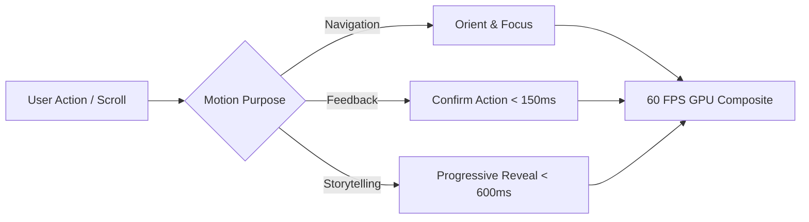
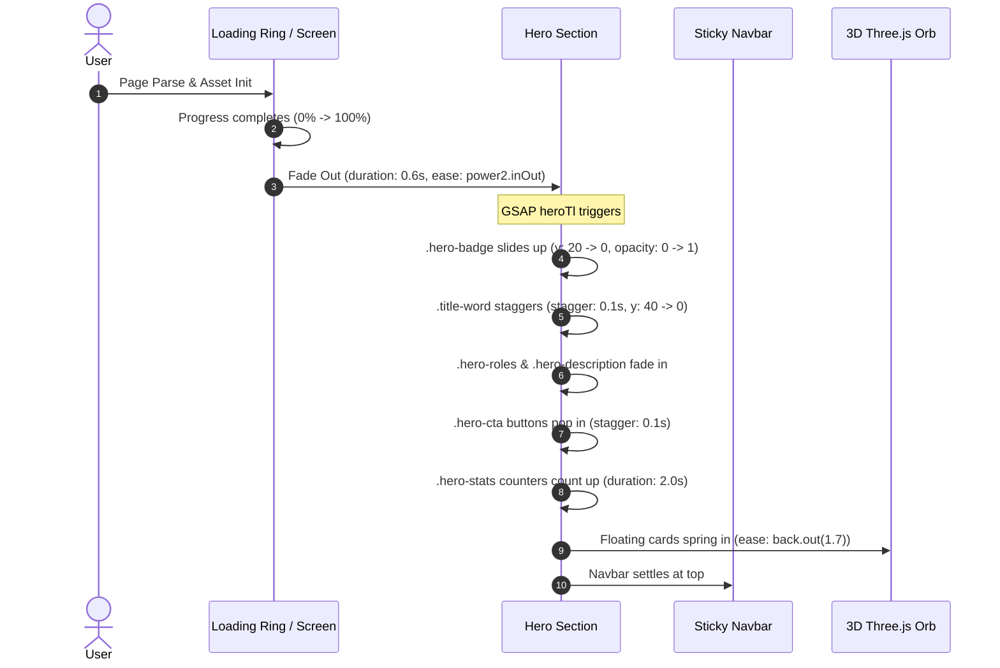
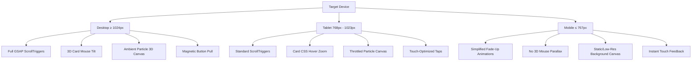

# PORTFOLIO MOTION SPECIFICATION & GSAP BLUEPRINT

**Core Philosophy**:  
> *"Motion must never become an excuse for poor performance. Every animation must serve a clear cognitive purpose: orienting the user, confirming interaction, or revealing technical hierarchy."*

---

## 1. Global Motion Principles



1. **Purpose-Driven**: No movement without intention. No random floating elements that distract from reading copy or viewing project case studies.
2. **Snappy & Organic Timing**:
   - Micro-interactions (hover, focus, button clicks): `120ms – 250ms` (eases: `power2.out`, `expo.out`).
   - Section reveals and card entries: `500ms – 800ms` (eases: `power3.out`, `cubic-bezier(0.2, 0.8, 0.2, 1)`).
3. **Strict Performance Boundaries**:
   - Animate ONLY `transform: translate3d / scale / rotate` and `opacity`.
   - Never animate `width`, `height`, `margin`, `padding`, or CSS `filter: blur()` continuously.
4. **Accessibility First**: Respect `prefers-reduced-motion` at all times.

---

## 2. Section-by-Section Motion Storyboard

### A. Page Load & Hero Entrance Timeline



#### Hero GSAP Parameter Spec:
- **Badge**: `gsap.from(".hero-badge", { y: 20, opacity: 0, duration: 0.7, ease: "power3.out" })`
- **Title Words**: `gsap.from(".title-word", { y: 40, opacity: 0, stagger: 0.1, duration: 0.7, ease: "power3.out" })`
- **Stats Counter**: Eased numeric increment `1 - Math.pow(1 - progress, 3)` running over 2000ms.
- **Floating Cards**: `gsap.from(".floating-card", { scale: 0.7, opacity: 0, stagger: 0.1, duration: 0.8, ease: "back.out(1.7)" })`

---

### B. Scroll-Triggered Section Entrances

| Section | Target Elements | Trigger Point | Animation Spec | Purpose |
| :--- | :--- | :--- | :--- | :--- |
| **All Sections** | `.section-header` | `top 85%` | `y: 35 -> 0`, `opacity: 0 -> 1`, `duration: 0.8s` | Clear section introduction |
| **Services** | `.service-card` | `top 80%` | `y: 35 -> 0`, `stagger: 0.15s`, `duration: 0.7s` | Establishes work focus |
| **About** | `.about-card`, `.profile-image-container` | `top 80%` | `x: -30 / +30 -> 0`, `opacity: 0 -> 1`, `duration: 0.8s` | Dual card focal balance |
| **Currently** | `.currently-item-card` | `top 82%` | `y: 25 -> 0`, `stagger: 0.12s`, `duration: 0.6s` | Rhythmical momentum items |
| **Projects** | `.project-card` | `top 80%` | `y: 30 -> 0`, `scale: 0.97 -> 1`, `stagger: 0.08s` | High-impact project showcase |
| **Tools** | `.tool-category` | `top 80%` | `y: 35 -> 0`, `stagger: 0.12s`, `duration: 0.7s` | Progressive toolbox scan |
| **Contact** | `.contact-info` | `top 80%` | `y: 35 -> 0`, `duration: 0.8s` | Concludes user journey |

---

### C. Interactive Project Card & Modal Dynamics

1. **Card 3D Perspective Hover**:
   ```javascript
   // Card perspective tilt calculation
   const rect = card.getBoundingClientRect();
   const x = (e.clientX - rect.left) / rect.width - 0.5; // [-0.5, 0.5]
   const y = (e.clientY - rect.top) / rect.height - 0.5; // [-0.5, 0.5]
   card.style.transform = `perspective(1000px) rotateY(${x * 8}deg) rotateX(${-y * 8}deg) translateY(-6px)`;
   ```
2. **Thumbnail Image Zoom**:
   - `transition: transform 0.6s cubic-bezier(0.2, 0.8, 0.2, 1)`
   - Hover scale: `scale(1.06)`
3. **Category Tab Filter Transition**:
   - On tab click: `gsap.fromTo('.project-card', { opacity: 0, y: 25, scale: 0.96 }, { opacity: 1, y: 0, scale: 1, duration: 0.45, stagger: 0.08, ease: "power2.out" })`
4. **Project Case Study Modal**:
   - Overlay: `opacity: 0 -> 1` (`0.3s`, `ease: power2.out`).
   - Modal Dialog: `scale: 0.92 -> 1`, `y: 20 -> 0` (`0.4s`, `ease: back.out(1.3)`).
   - Scroll lock enabled on `document.body`.

---

### D. Scroll Progress & Navigation Bar

- **Top Scroll Progress Bar**:
  - `height: 3.5px`, `background: linear-gradient(90deg, #7c5cff, #00f5d4, #ff3366)`
  - Width maps directly to `(scrollY / totalHeight) * 100%`.
- **Floating Scroll & Back to Top Pill**:
  - Appears when `scrollY > 260px` with `transform: translateY(0)`, `opacity: 1`.
  - Shows dynamic percentage counter (`scrollPercent.textContent = Math.round(progress) + '%'`).
  - Clicking triggers `window.scrollTo({ top: 0, behavior: 'smooth' })`.

---

## 3. Responsive Motion Strategy



---

## 4. Accessibility & Reduced-Motion Engine

When `prefers-reduced-motion: reduce` is detected via CSS or JS:

```css
@media (prefers-reduced-motion: reduce) {
    *, *::before, *::after {
        animation-duration: 0.01ms !important;
        animation-iteration-count: 1 !important;
        transition-duration: 0.01ms !important;
        scroll-behavior: auto !important;
    }
    .floating-card, #bgCanvas, #heroOrb {
        animation: none !important;
    }
    .project-card, .skill-card {
        transform: none !important;
        transition: none !important;
    }
}
```

In JavaScript / GSAP:
```javascript
if (window.matchMedia('(prefers-reduced-motion: reduce)').matches) {
    gsap.globalTimeline.timeScale(100); // Instantly complete tweens
}
```

---

## 5. WebGL Three.js Performance Throttling Guard

To ensure Three.js does not drain battery or block main thread:
```javascript
// Disconnect animation loop when canvas is off-screen
const canvasObserver = new IntersectionObserver((entries) => {
    entries.forEach(entry => {
        isCanvasVisible = entry.isIntersecting;
    });
}, { threshold: 0.05 });

canvasObserver.observe(document.getElementById('hero'));

function renderLoop() {
    if (isCanvasVisible && !document.hidden) {
        renderer.render(scene, camera);
    }
    requestAnimationFrame(renderLoop);
}
```
