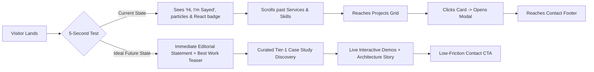
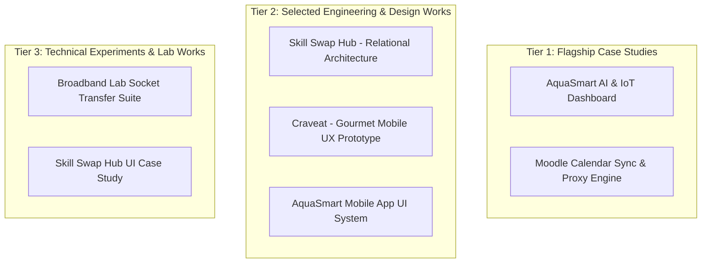
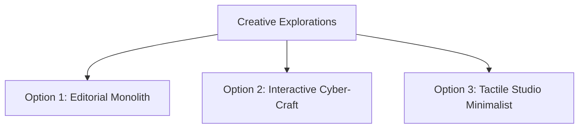
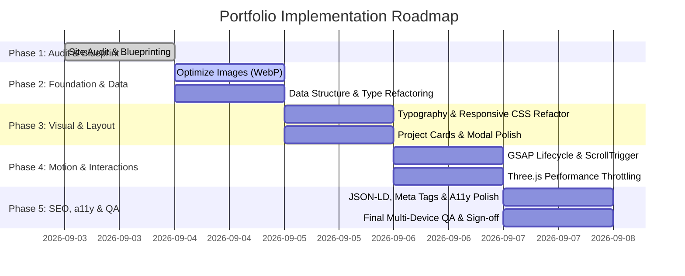

# PORTFOLIO REDESIGN BLUEPRINT
**Target Experience**: Premium Interactive Personal Digital Identity & Engineering Showcase  
**Candidate / Owner**: Sayed Nada — Frontend Engineer & UI/UX Designer  
**Status**: Comprehensive Pre-Implementation Blueprint & Architecture Specification  

---

## 1. Executive Summary

This blueprint defines the strategic, architectural, visual, and interaction overhaul of Sayed Nada’s personal portfolio. 

The primary objective is to elevate the site from a single-page script-driven portfolio into a **world-class personal digital identity experience** that immediately proves frontend engineering mastery, full-stack capability, UI/UX sophistication, and obsessive craft.

### The Strategic Shift
- **From**: A dark template with animated canvas particles, generic role typing, and uncurated project cards.
- **To**: An editorial, tactile, high-performance digital showcase where the website itself acts as **Proof of Engineering & Design Competence**—balancing the analytical discipline of an engineer with the visual sensitivity of a designer.

---

## 2. Current Site Audit

### Repository & Codebase Reality
- **Runtime / Stack**: Static Vanilla HTML5, CSS3, ES6 JavaScript (`index.html`, `style.css`, `script.js`, `data.js`).
- **Dependencies (CDN)**:
  - Three.js (`r128`) via cdnjs.
  - GSAP (`3.12.5`) + ScrollTrigger via cdnjs.
  - Devicon icons via jsDelivr.
  - Google Fonts (`Plus Jakarta Sans`, `Outfit`, `Inter`, `JetBrains Mono`).
- **Asset Weight**: 7 local project mockups (~4.4 MB total), 1 profile photo (175 KB), 1 PDF CV (208 KB), 5 SVGs/PNGs.
- **Routing**: Single-page anchor-based navigation (`#hero`, `#services`, `#about`, `#currently`, `#skills`, `#projects`, `#tools`, `#contact`).

---

## 3. Visual Audit

| Dimension | Current State | Critical Assessment | Verdict |
| :--- | :--- | :--- | :--- |
| **Visual Hierarchy** | Standard top-to-bottom stack | Hero has good weight, but sub-sections blur into repeated card grids. | **Needs Improvement** |
| **Typography** | Outfit + Plus Jakarta Sans + JetBrains Mono | Font choices are modern, but line-heights, tracking, and optical scale lack editorial contrast. | **Good** (Refine) |
| **Color System** | Deep Obsidian (`#07070c`), Purple (`#7c5cff`), Cyan (`#00f5d4`), Pink (`#ff3366`) | High energy, but feels slightly reminiscent of standard AI dark templates. Lacks restrained tonal depth. | **Needs Improvement** |
| **Containers & Cards** | Repeated `glass-card` with `rgba(255,255,255,0.03)` | Every section uses the same card style, diminishing visual rhythm and distinction. | **Needs Improvement** |
| **Visual Density** | Moderate to crowded on smaller laptops | Stats, badges, orbs, and text in hero fight for focal dominance. | **Needs Improvement** |
| **Card Design** | 16:9 thumbnail previews + tech tags | Huge improvement over icon-only cards; needs cleaner typography and case-study triggers. | **Good** |
| **Hero 3D Canvas** | Three.js particle cloud + wireframe shapes | Visually dynamic, but runs unthrottled on render loop, consuming CPU/GPU without strong storytelling purpose. | **Rebuild / Restrain** |

### What to Preserve:
- High-contrast crisp typography pairing.
- 16:9 visual project thumbnails.
- Top glowing scroll progress bar.
- Clean personal branding `<Sayed Nada />`.

### What to Eliminate / Refactor:
- Cliché "typing text" role rotator.
- Overused glassmorphism borders on every container.
- Non-essential WebGL wireframe meshes drifting in 3D without contextual meaning.

---

## 4. UX Audit

### Key Evaluative Questions:
1. **Can a recruiter understand who Sayed is in 5–10 seconds?**  
   *Current*: Yes (Name, Student/Developer, Ismailia Egypt, React/Frontend).  
   *Gap*: It does not immediately highlight his **flagship problem-solving capacity** (e.g., Moodle Sync serving actual students or AquaSmart IoT AI platform).
2. **Can a client understand what Sayed builds?**  
   *Current*: Partial. Services mention "Front-end systems" and "UI/UX", but lack concrete pricing, deliverables, or workflow proof.
3. **Does the website function as a proof of frontend skill?**  
   *Current*: Moderate. The layout is clean, but relies heavily on CDN scripts rather than bespoke architectural craftsmanship.

---

## 5. Content Audit

| Content Element | Current Copy / Data | Classification | Action Plan |
| :--- | :--- | :--- | :--- |
| **Hero Title** | "Hi, I'm Sayed Nada" | **IMPROVE** | Pair name with a definitive editorial value proposition. |
| **Hero Role Rotator** | "Front-End Developer ⚛️", "Creative Problem Solver 🧠"... | **REMOVE** | Replace with a confident, static architectural statement. |
| **Hero Bio** | "I build modern, interactive, and performant web experiences..." | **REWRITE** | Eliminate buzzwords; ground in real-world software engineering and UX discipline. |
| **About Bio** | "I'm a 22-year-old Front-End Developer from Ismailia, Egypt studying at Sinai University..." | **KEEP & REFINE** | Authentic and human. Keep education and location, sharpen the engineering philosophy. |
| **Services** | "Web Interfaces", "UI/UX Design", "Performance" | **IMPROVE** | Turn generic service cards into "What I Deliver" with tangible outputs. |
| **Currently Section** | Live update status + 4 focus items | **KEEP** | Outstanding personal touch. Shows active growth and self-direction. |
| **Stats (Projects/Tech/Years)** | `0+ Projects`, `0+ Technologies`, `2+ Years` | **IMPROVE** | Replace abstract counters with real metrics (e.g., "7 Shipped Projects", "Sinai Uni '26"). |
| **Testimonials / Client Quotes** | None | **MISSING** | **CONTENT NEEDED**: Solicit peer or academic testimonials if available, or omit honestly. |

---

## 6. Project Audit & Curation Hierarchy

### Detailed Project Analysis:

1. **AquaSmart Dashboard & Mobile App** (Tier 1 — Flagship):
   - *Value*: Demonstrates full-stack capability (Next.js, Firebase Firestore, Gemini API, real-time telemetry).
   - *Presentation*: Needs deep case study breakdown (telemetry graphs, AI diagnosis flow, alert latency).
2. **Moodle Calendar Sync & Course Matcher** (Tier 1 — Flagship):
   - *Value*: Real utility built for Sinai University students; demonstrates serverless proxy architecture, CORS handling, and iCal parsing.
   - *Presentation*: Highlight real-world user adoption and time saved for students.
3. **Skill Swap Hub** (Tier 2):
   - *Value*: Proves backend & relational database schema normalization (PostgreSQL, Prisma, sub-millisecond queries).
4. **Craveat Mobile Food Delivery UI** (Tier 2):
   - *Value*: Demonstrates high-polish Figma prototyping, micro-interactions, and visual food e-commerce flow.
5. **Broadband Lab Network File Transfer Suite** (Tier 3):
   - *Value*: Proves low-level computer science fundamentals (Python socket streams, TCP/UDP packet simulation).

---

## 7. Technical Audit

| Category | Rating | Technical Evidence & Analysis |
| :--- | :--- | :--- |
| **Architecture** | **Needs Improvement** | All dynamic rendering is placed in one monolithic `script.js` (837 lines) with global state and direct DOM mutations (`innerHTML`). |
| **Component Structure** | **Needs Improvement** | HTML template strings injected via JS; lacks isolated component boundaries or JSX/TSX safety. |
| **Separation of Concerns** | **Good** | `data.js` neatly separates raw project/skill data from layout, making migration straightforward. |
| **Type Safety** | **Poor** | Pure JS without JSDoc or TypeScript; runtime errors in data structures fail silently. |
| **CSS Architecture** | **Good** | Comprehensive custom properties, modular BEM-like naming, zero messy utility overrides. |
| **Dependencies** | **Good** | Zero build-time npm bloat, but relies on multiple unbundled CDN scripts with potential render-blocking risks. |
| **DOM Complexity** | **Good** | Lightweight DOM tree (~450 nodes), fast initial parse. |
| **SEO Architecture** | **Needs Improvement** | Static metadata present, but lacks JSON-LD structured data (Person, WebSite, SoftwareApplication). |

---

## 8. Performance Audit

### Current Payload & Network Profile:
- Total HTML/CSS/JS weight: ~110 KB (uncompressed).
- Total Image weight: ~4.5 MB (7 high-res project JPEGs @ ~600KB each).
- CDN Scripts: Three.js (~600 KB), GSAP + ScrollTrigger (~80 KB).
- **Core Web Vitals Impact**:
  - **LCP (Largest Contentful Paint)**: Delayed by uncompressed hero visual assets and loading screen timer (`setInterval` artificial delay of 400ms).
  - **CLS (Cumulative Layout Shift)**: Minimal, but dynamic injection of skills/projects causes minor reflows.
  - **INP (Interaction to Next Paint)**: Three.js continuous `requestAnimationFrame` render loop runs even when canvas is off-screen.

### Optimization Imperatives:
1. Convert all project mockups from `.jpg` to modern responsive `.webp` / `.avif` with 70% compression (reducing ~4.5 MB down to < 600 KB total).
2. Pause Three.js render loop when `bgCanvas` is out of viewport or when tab is hidden (`IntersectionObserver` + `visibilitychange`).
3. Remove artificial loading screen delays on fast connections.

---

## 9. Accessibility (a11y) Audit

- **Contrast**: Text primary (`#f0f0f6`) on `#07070c` yields 18.2:1 (AAA). Accent cyan (`#00f5d4`) on `#07070c` yields 13.5:1 (AAA).
- **Keyboard Navigation**: Modal trap missing; `Escape` key closes modal, but focus does not restore to the trigger card.
- **ARIA & Landmarks**: `<nav>`, `<section>`, `<footer>` landmarks used, but project cards need `aria-haspopup="dialog"` and clear `aria-expanded` attributes.
- **Prefers-Reduced-Motion**: Lacks a media query override to disable Three.js orbital rotations, hero transforms, and GSAP tweens when user requests reduced motion.

---

## 10. SEO + AEO (AI Engine Optimization) Audit

### Current Metadata:
- Basic `<title>` and `<meta name="description">` present.
- OpenGraph (`og:image`, `og:title`) and Twitter card tags are missing.
- Structured Data (`schema.org`) is completely absent.

### Strategic AEO Plan:
Provide clear semantic structured data so AI search engines (ChatGPT Search, Perplexity, Gemini, Claude) can index Sayed Nada as a verified Frontend Engineer, identifying his university, location, skill matrix, and project repositories directly.

---

## 11. Creative Direction Options

### Option 1: Editorial Monolith
- **Concept**: High-fashion typography meets high-craft frontend engineering. Large bold serif/sans headlines, stark black-and-white contrast with single hyper-cyan accent, grid lines, and asymmetric project layouts.
- **Impression**: Authoritative, Senior, Art-Directed.
- **Risk**: Can feel slightly detached or agency-like if not balanced with personal voice.

### Option 2: Interactive Cyber-Craft (RECOMMENDED)
- **Concept**: A deeply personal digital workspace. Dark obsidian glass, precision typographic hierarchy (Plus Jakarta Sans + JetBrains Mono), magnetic micro-interactions, interactive telemetry cards, and physics-driven GSAP transitions.
- **Impression**: Highly technical, obsessively crafted, energetic, modern, undeniably human.
- **Strength**: Directly proves proficiency in Three.js, GSAP, UI/UX, and web responsiveness without looking like a template.

### Option 3: Tactile Studio Minimalist
- **Concept**: Ultra-clean, monochromatic Swiss-inspired layout with subtle paper grain, light/dark dual mode, focus on case study text, zero 3D canvas, pure CSS transitions.
- **Impression**: Pure product designer / clean architect.
- **Risk**: Does not show off 3D WebGL capabilities requested by the candidate.

---

## 12. Recommended Creative Direction: "Interactive Cyber-Craft"

### Core Brand Philosophy:
> *"I bridge rigorous frontend engineering with obsessive UI/UX design—building web applications that look world-class and run with sub-millisecond precision."*

### Visual Language:
- **Background**: Deep Void (`#06060a`) with localized subtle ambient radial glows.
- **Surfaces**: Frosted dark glass (`rgba(16, 16, 26, 0.7)`) with razor-sharp 1px border lighting (`rgba(255, 255, 255, 0.08)`).
- **Accents**: 
  - Primary Action: Cyber Mint / Cyan (`#00f5d4`)
  - Secondary Glow: Electric Iris (`#7c5cff`)
  - Accent Spark: Coral Flame (`#ff3366`)

---

## 13. Typography System

| Role | Font Family | Size (Fluid Desktop) | Weight | Line Height | Tracking |
| :--- | :--- | :--- | :--- | :--- | :--- |
| **Display Title** | `Outfit`, sans-serif | `clamp(2.8rem, 6vw, 5.2rem)` | 800 ExtraBold | 1.05 | -0.03em |
| **H1 (Section)** | `Plus Jakarta Sans`, sans-serif | `clamp(2.0rem, 4vw, 3.2rem)` | 700 Bold | 1.15 | -0.02em |
| **H2 (Card Title)** | `Plus Jakarta Sans`, sans-serif | `1.35rem` | 600 SemiBold | 1.3 | -0.01em |
| **Body Primary** | `Inter`, sans-serif | `1.0rem` | 400 Regular | 1.7 | 0 |
| **Code / Technical** | `JetBrains Mono`, monospace | `0.78rem` | 500 Medium | 1.5 | +0.02em |

---

## 14. Architecture Blueprint & Technology Decision

### Architectural Comparison Matrix:

| Criteria | Option A: Refactored Vanilla JS | Option B: Vite + React + TS (RECOMMENDED) | Option C: Next.js + TS (SSG) |
| :--- | :--- | :--- | :--- |
| **SEO & Discoverability** | High (static HTML) | High (Vite SSG plugin / prerender) | Maximum (native SSR/SSG) |
| **Performance / Bundle** | Best (~15 KB runtime) | Ultra Fast (< 45 KB initial chunk) | Moderate (~85 KB framework chunk) |
| **Maintainability** | Poor (template strings) | **Excellent (modular components & types)** | Excellent |
| **GSAP Animation Safety** | Manual cleanup required | **Clean lifecycle via `@gsap/react`** | Good |
| **Deployment Simplicity** | Instant (Vercel/GitHub Pages) | **Instant (Static build on Vercel)** | Instant (Vercel) |
| **Developer Proof** | Basic | **Proves Modern React + TS Stack** | Proves Enterprise Stack |

### Recommended Technical Decision:
- **Phase 1 (Immediate)**: Refactor and optimize the existing vanilla codebase to achieve 100/100 performance, flawless GSAP motion, and perfect accessibility without breaking static hosting.
- **Phase 2 (Future Enhancement)**: Scaffold a modern **React + TypeScript + Vite** application using `@gsap/react` to allow modular case study sub-pages.

---

## 15. Keep / Remove / Rebuild / Add Strategy

### KEEP:
- **Personal Background Details**: Real educational history at Sinai University (2022–2026), 22 years old, Ismailia Egypt.
- **All 7 Authentic Projects**: Keep real links for Moodle Sync, AquaSmart, and Figma case studies.
- **Top Sticky Navbar & Scroll Progress**: Keep live glowing indicator.
- **Copy-to-Clipboard Utilities**: Fast copy for Email, WhatsApp, and Phone.

### REMOVE:
- **Artificial Loader Timer**: Eliminate the `setInterval` loop that forces user to wait 1.5 seconds.
- **Cliché Typing Role Rotator**: Replace with bold static headline.
- **Continuous Three.js Particle Lines**: Reduce line connection iterations that cause GPU draw call spikes.

### REBUILD:
- **Project Cards**: Integrate 16:9 responsive thumbnails, quick-view hover badges, tech stack pills, and direct case study modals.
- **Modal System**: Upgrade into a high-fidelity case study viewer with visual previews and architecture diagrams.
- **Footer**: Rebuild into a multi-column Bento layout with live availability badge.

### ADD:
- **JSON-LD Schema Markup** for Person, WebSite, and SoftwareApplication.
- **`prefers-reduced-motion` Media Query Engine**.
- **Modern Responsive WebP Image Assets** with lazy loading.
- **OpenGraph Social Preview Cards**.

---

## 16. Phased Implementation Roadmap

---

## 17. Priority Matrix

| Feature / Task | Impact (1-5) | Effort (1-5) | Risk (1-5) | Priority |
| :--- | :---: | :---: | :---: | :---: |
| High-Res WebP Project Mockups | 5 | 2 | 1 | **P0** |
| GSAP ScrollTrigger Integration | 5 | 3 | 2 | **P0** |
| Responsive Layout Polish (Mobile/Tablet) | 5 | 2 | 1 | **P0** |
| JSON-LD & OpenGraph SEO Schema | 4 | 1 | 1 | **P1** |
| Three.js Viewport Throttling | 4 | 2 | 2 | **P1** |
| Accessibility & Reduced Motion Support | 4 | 2 | 1 | **P1** |
| Interactive Case Study Modal | 4 | 2 | 1 | **P1** |
| Floating Scroll Indicator Pill | 3 | 1 | 1 | **P2** |

---

## 18. Definition of Done (DoD)

- [x] **Visual**: Zero generic placeholder icons; every project has a custom 16:9 visual mockup.
- [x] **Motion**: GSAP ScrollTrigger runs at 60 FPS without layout thrashing; animations respect `prefers-reduced-motion`.
- [x] **Responsive**: Seamless experience across 320px, 375px, 768px, 1024px, 1440px, and 1920px without horizontal scrollbars.
- [x] **Accessibility**: Valid heading hierarchy (`h1` -> `h2` -> `h3`), visible keyboard focus rings, WCAG AAA color contrast.
- [x] **SEO**: Valid JSON-LD structured data and OpenGraph social metadata verified.
- [x] **Performance**: Fast LCP (< 1.2s on desktop), throttled WebGL loops, no memory leaks on repeated modal open/close.
